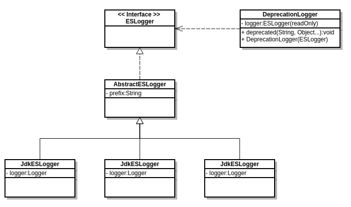

Table of Contents
=================

   * [ES 日志模块](#es-日志模块)
      * [ESLogger](#eslogger)
      * [ESLoggerFactory](#esloggerfactory)
      * [LoggerMessageFormat](#loggermessageformat)

Created by [gh-md-toc](https://github.com/ekalinin/github-markdown-toc)

# ES 日志模块

Elasticsearch 在常见的日志模块(log4j, slf4j)基础之上又做了进一步的封装. 为ES整个系统中所有组件提供日志服务.

## ESLogger



如图所示, ESLogger采用很典型的设计方式:

+ 接口 ESLogger 定义了对外提供服务的方法
+ 抽象类 AbstractESLogger 封装了子类的公共代码, 具体实现细节交由子类完成
+ 子类 Log4jESLogger 优先选择使用 log4j 实现
+ 子类 Slf4jESLogger log4j 实现没有加载成功使用 slf4j 
+ 子类 JdkESLogger 前面都没有加载成功最终退化为 java 内部实现
+ 类 DeprecationLogger 通过修饰 ESLogger 可以输出 deprecated 信息

## ESLoggerFactory


抽象工厂 ESLoggerFactory 定义了默认的工厂实现, 默认顺序如前所述, 代码如下:

``` java
	// ES 2.3
	
    private static volatile ESLoggerFactory defaultFactory = new JdkESLoggerFactory();

    static {
        try {
            Class<?> loggerClazz = Class.forName("org.apache.log4j.Logger");
            // below will throw a NoSuchMethod failure with using slf4j log4j bridge
            loggerClazz.getMethod("setLevel", Class.forName("org.apache.log4j.Level"));
            defaultFactory = new Log4jESLoggerFactory();
        } catch (Throwable e) {
            // no log4j
            try {
                Class.forName("org.slf4j.Logger");
                defaultFactory = new Slf4jESLoggerFactory();
            } catch (Throwable e1) {
                // no slf4j
            }
        }
    }

    /**
     * Changes the default factory.
     */
    public static void setDefaultFactory(ESLoggerFactory defaultFactory) {
        if (defaultFactory == null) {
            throw new NullPointerException("defaultFactory");
        }
        ESLoggerFactory.defaultFactory = defaultFactory;
    }
```

## LoggerMessageFormat

ESLogger 并没有直接使用日志组件中的 format 功能, 而是自行实现了一套, 具体细节此处不表, 详情可见 org.elasticsearch.common.logging.support.LoggerMessageFormat