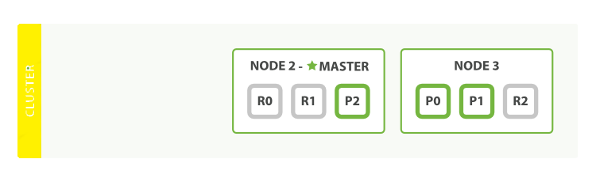
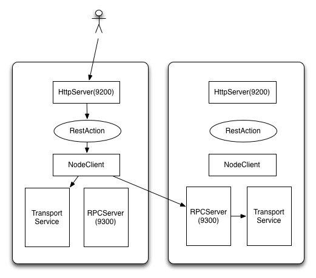
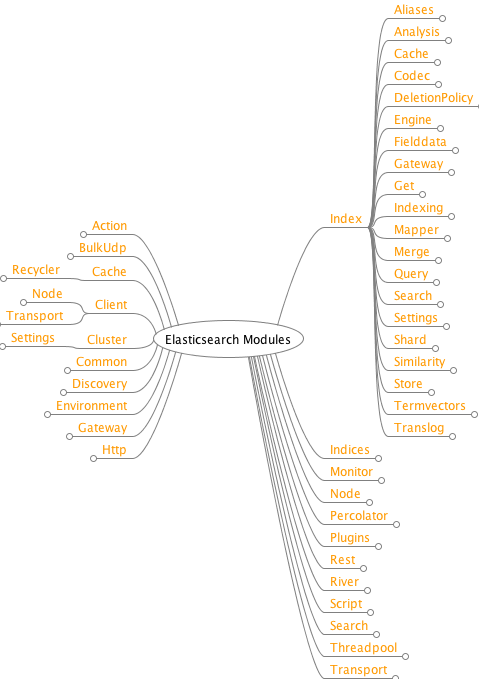

# Elasticsearch Overview

Table of Contents
=================

   * [Elasticsearch Overview](#elasticsearch-overview)
      * [Getting Started](#getting-started)
      * [Glossary](#glossary)
      * [Cluster](#cluster)
      * [framework](#framework)
         * [Networking](#networking)
      * [Modules](#modules)
      * [other](#other)

Created by [gh-md-toc](https://github.com/ekalinin/github-markdown-toc)

## Getting Started

Elasticsearch 是一个开源的搜索引擎, 建立在一个全文搜索引擎库 Apache Lucene 基础之上. Elasticsearch 的目的是使全文检索变得简单, 通过隐藏 Lucene 的复杂性, 取而代之的提供一套简单一致的 RESTful API. 它可以被下面这样准确的形容:

+ 一个分布式的实时文档存储，每个字段可以被索引与搜索
+ 一个分布式实时分析搜索引擎
+ 能胜任上百个服务节点的扩展，并支持 PB 级别的结构化或者非结构化数据

就 Elasticsearch 而言, 起步很简单. 对于初学者来说, 它预设了一些适当的默认值, 并隐藏了复杂的搜索理论知识. 开箱即用. 只需最少的理解, 你很快就能具有生产力.

## Glossary

1. 节点(Node) 一个运行中的 Elasticsearch 实例称为一个节点
2. 集群(Cluster) 集群是由一个或者多个拥有相同 cluster.name 配置的节点组成, 它们共同承担数据和负载的压力
3. 分片(Shard) 分片是一个底层的工作单元, 它仅保存了全部数据中的一部分, 一个分片是一个Lucene 的实例, 一个分片可以是主分片或者副本分片

  + 主分片(Primary Shard) 索引内任意一个文档都归属于一个主分片, 主分片的数目决定着索引能够保存的最大数据量
  + 副本分片(Replica Shard) 一个副本分片只是一个主分片的拷贝
4. 索引(Index) 索引是指向一个或者多个物理分片的逻辑命名空间
5. 文档(Document)  相当于数据库中的行(row)
6. 字段(Field) 相当于数据库中的列(column)
7. 映射(Mapping) 相当于数据的 schema, 可以约束字段类型
8. 类型(Type) **类似**于数据库中 table 的概念, 同一个索引可以包含多个类型.

## Cluster

如上图所示, ES集群有三个节点. 一个索引有三个主分片, 副本数为1, 即每个主分片有一个对应的副本. 分片是一个功能完整的搜索引擎, 它拥有使用一个节点上的所有资源的能力. 我们这个拥有6个分片(3个主分片和3个副本分片)的索引可以最大扩容到6个节点, 每个节点上存在一个分片, 并且每个分片拥有所在节点的全部资源.

> 如果对写入性能有要求, 预先在设计索引主分片数时, 应考虑今后扩容的可能性, 主分片数量过少, 有可能导致扩容无效.

主分片的数目在索引创建时就已经确定了下来. 实际上, 这个数目定义了这个索引能够 存储 的最大数据量. 但是, 读操作 (搜索和返回数据) 可以同时被主分片或副本分片所处理, 所以当你拥有越多的副本分片时, 也将拥有越高的吞吐量.

> 一个主分片最大能够存储 Integer.MAX_VALUE - 128 个文档, 但是实际最大值还需要参考你的使用场景: 包括你使用的硬件, 文档的大小和复杂程度, 索引和查询文档的方式以及你期望的响应时长.

在运行中的集群上是可以动态调整副本分片数目的, 我们可以按需伸缩集群.  如上图索引副本数已经调整为2.

> 增加副本数并不一定提高吞吐, 因为每个分片可以获得的资源可能变少. 但是副本可以提供数据冗余, 上图中的情况, 即使损失两个节点也可以保证数据完整.

在发生节点故障时, 副本分片会被升级为主分片, 集群状态变为 yellow. 如图:

> 三种集群状态: red, yellow, green
> 1. red, 有主分片没能正常运行
> 2. yellow, 所有的主分片都正常运行, 但不是所有的副本分片都正常运行
> 3. green, 所有的主分片和副本分片都正常运行

## framework

Elasticsearch 依赖注入使用[Guice](https://github.com/google/guice), 网络通信使用[Netty](https://github.com/netty/netty).

> **以下内容来自[午夜咖啡](http://jolestar.com)**
> Rest 和 RPC
>
> 
>
> Elasticsearch 的rest请求的传递流程如上图 (这里对实际流程做了简化):
>
> 1. 用户发起http请求, Elasticsearch 的9200端口接受请求后, 传递给对应的RestAction
> 2. RestAction做的事情很简单, 将rest请求转换为RPC的TransportRequest, 然后调用NodeClient, 相当于用客户端的方式请求RPC服务, 只不过transport层会对本节点的请求特殊处理
>
> 这样做的好处是将http和RPC两层隔离, 增加部署的灵活性. 部署的时候既可以同时开启RPC和http服务, 也可以用client模式部署一组服务专门提供http rest服务, 另外一组只开启RPC服务, 专门做data节点, 便于分担压力.
> Elasticsearch 的RPC的序列化机制使用了 Lucene 的压缩数据类型, 支持vint这样的变长数字类型, 省略了字段名, 用流式方式按顺序写入字段的值. 每个需要传输的对象都需要实现:
> > void writeTo(StreamOutput out) 
> > T readFrom(StreamInput in) 
>
> 两个方法. 虽然这样实现开发成本略高, 增删字段也不太灵活, 但对 Elasticsearch 这样的数据库系统来说, 不用考虑跨语言, 增删字段肯定要考虑兼容性, 这样做效率最高. 所以 Elasticsearch 的RPC接口只有java client可以直接请求, 其他语言的客户端都走的是rest接口.

### Networking

*以下内容参考 : [Elasticsearch Internals: Networking Introduction](https://www.elastic.co/blog/found-elasticsearch-networking) 2013-11-05*

集群中每个节点都与其他节点相连, 构成一个完全的网状拓扑结构 ([full mesh topology](https://en.wikipedia.org/wiki/Network_topology#Mesh)). 在

Elasticsearch使用(默认情况下)TCP进行节点之间的通信，但是为了防止诸如故障检测和集群状态更改等重要流量受到其他不太重要流量(如查询/索引请求)的影响, 会创建多个TCP 连接. 这些连接在 Elasticsearch 中被称为 channel，它封装了消息在特定连接上的序列化/反序列化.

+ recovery: 2个负责索引数据恢复的 channel
+ bulk: 3个负责批量基本请求的 channel, 比如批量建索引(low)
+ reg: 6个负责正常操作请求的 channel, 比如查询请求(med)
+ state: 1个专门负责集群状态相关操作的 channel, 比如更改集群状态(high)
+ ping: 1个专门负责节点间 ping 操作的 channel, 用于故障检测

所以实际是连接情况是上图这样的. 由于使用的连接都是 one-way, 所以还要算上回来的连接.

## Modules

下图是官方早期提供的概览图: [Elasticsearch Internals: an Overview](https://www.elastic.co/blog/found-elasticsearch-internals) 2013-10-02

Elasticsearch 2.3.X 代码中, Node对象初始化时直接加载的 modules :

1. Version.Module
2. CircuitBreakerModule
3. PluginsModule
4. SettingsModule
5. NodeModule
6. NetworkModule
7. ScriptModule
8. EnvironmentModule
9. NodeEnvironmentModule
10. ClusterNameModule
11. ThreadPoolModule
12. DiscoveryModule
13. ClusterModule
14. RestModule
15. TransportModule
16. HttpServerModule
17. IndicesModule
18. SearchModule
19. ActionModule
20. MonitorModule
21. GatewayModule
22. NodeClientModule
23. ShapeModule
24. PercolatorModule
25. ResourceWatcherModule
26. RepositoriesModule
27. TribeModule

## other

目前 Elasticsearch 是一个十分活跃的产品, 尤其在日志收集处理方面(感觉有点偏离初心). 目前最新的稳定版是 5.4.0 (2017-05-04, 青年节发版精神可嘉). 而且 elastic 公司也开始关注中国市场, 逐步开始汉化文档.

与之配套提供的工具还有 Beats, Logstash, Kibana, X-Pack
