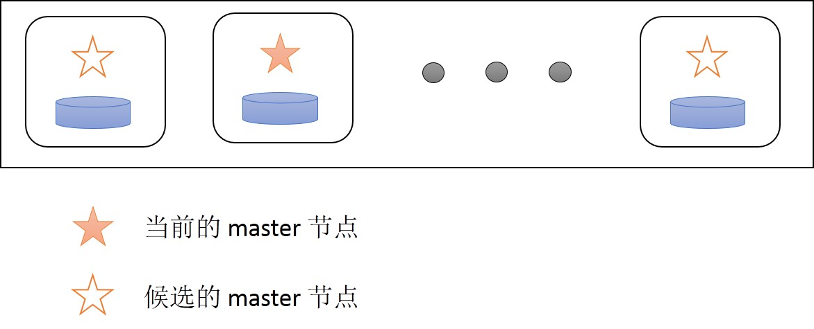
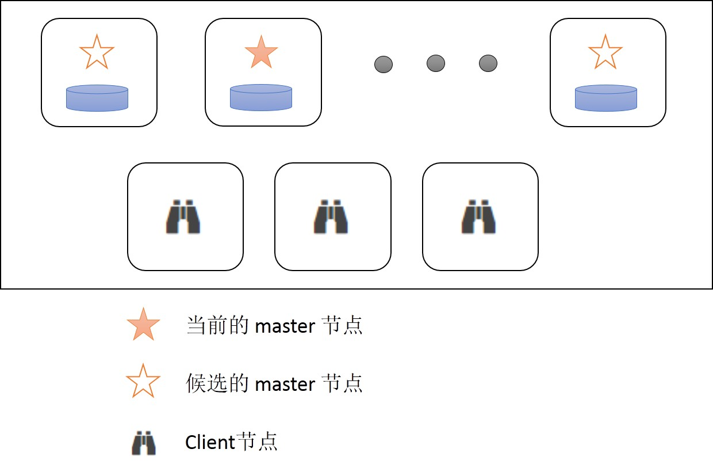
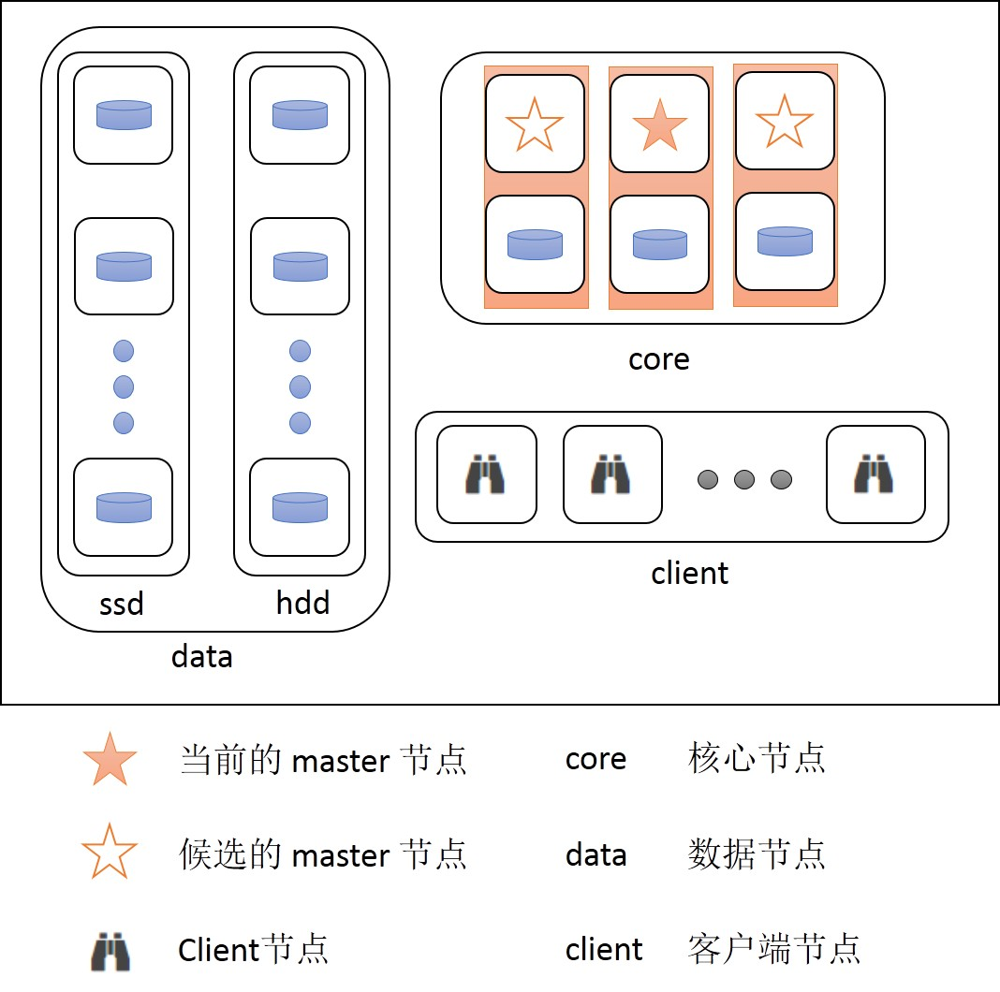

# Elasticsearch 部署方式简介


## 1. simple

### 1.1 simple
简单部署方式有以下几个特点:

1. 每个节点都是 [master 候选节点](https://www.elastic.co/guide/en/elasticsearch/reference/current/modules-node.html#master-node)
2. 每个节点都是 [data 节点](https://www.elastic.co/guide/en/elasticsearch/reference/current/modules-node.html#data-node)

部署结构如图:




优点:

+ 部署方便

缺点:

+ master 节点身兼多职, 容易造成 master 节点响应慢, 导致集群异常.

适用场景:

+ 数据量很小, 写入读取的压力都不大的情况下, 采用这种方式部署十分便捷.

### 1.2 simple + client

在简单部署方式的基础上增加 [Client 节点](https://www.elastic.co/guide/en/elasticsearch/reference/current/modules-node.html#client-node)

部署结构如图:




优点:

+ 通过 client 节点进行读取操作, 可以避免大型聚合语句造成的节点 out of memory 时, 影响集群性能(client 节点离线不影响集群).
+ 写入时, 可以由 client 节点将每个文档直接转发到对应的 data 节点上进行写入, 避免了数据节点之间的数据转发.

缺点:

+ 需要资源多

## 2. standalone master-eligible node

集群规模较大, 或者对集群稳定性要求较高的情况下, 我们需要使用专职 master 节点, 尽量让 master 节点承担较少的工作量.

> While master nodes can also behave as coordinating nodes and route search and indexing requests from clients to data nodes, it is better not to use dedicated master nodes for this purpose. It is important for the stability of the cluster that master-eligible nodes do as little work as possible.

> To create a standalone master-eligible node, set:
> 
> [传送门](https://www.elastic.co/guide/en/elasticsearch/reference/current/modules-node.html#master-node)


``` json
    node.master: true 
    node.data: false 
```

### 2.1 core cluster

部署结构如图:




core 节点中包含若干数据节点, 可以用来存储一些特殊索引, 比如 kibana 索引或者 marvel 索引等.

优点:

+ master 节点只承担调度工作, 无数据读写任务, 集群稳定性较高.
+ 保持 core 节点不变的情况下, 支持数据透明迁移.
+ 模块化部署, 可以在 core 节点上插拔各种节点.

缺点:

+ 搭建较为复杂


### 2.2 multi-node on a single machine

由于 [32G Heap](https://www.elastic.co/guide/en/elasticsearch/guide/2.x/heap-sizing.html#compressed_oops) 的问题导致我们在采用大内存物理机时可能会面临一台机器上搭建多个节点的情况.

此时需要注意要对 core 节点和其他节点进行机器隔离, 同时通过 ES 的[分片分配策略](https://www.elastic.co/guide/en/elasticsearch/reference/current/allocation-awareness.html)保证主从分片不分配在同一台物理机上.

同时 master 节点之间需要进行机器隔离, 防止一台机器宕机导致所有或者大部分 master 节点不可用的情况.

部署结构参照上图即可.
