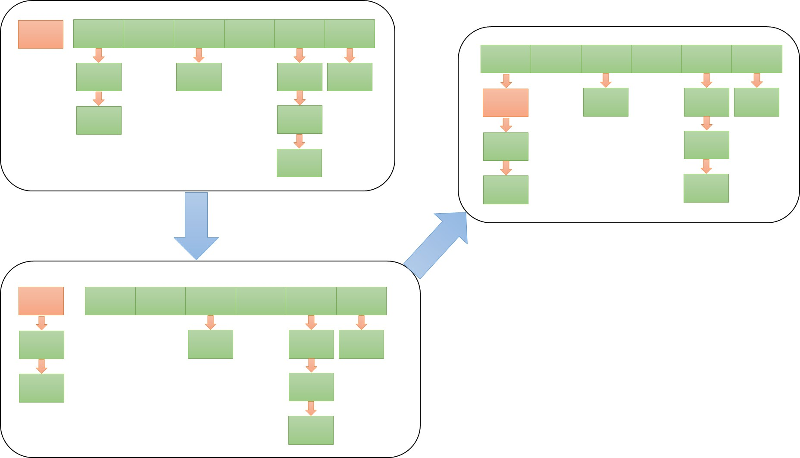

# HashMap源码分析

Table of Contents
=================
   * [HashMap源码分析](#hashmap源码分析)
         * [1. HashMap的数据结构：](#1-hashmap的数据结构)
         * [2.构造函数](#2构造函数)
         * [3.put操作](#3put操作)
         * [4.get操作](#4get操作)
         * [5. Fail-Fast机制](#5-fail-fast机制)
         * [参考](#参考)

Created by [gh-md-toc](https://github.com/ekalinin/github-markdown-toc)

链表和数组可以按照人们意愿排列元素的次序，但是，如果想要查看某个指定的元素，却又忘记了它的位置，就需要访问所有的元素，直到找到为止。如果集合中元素很多，将会消耗很多时间。有一种数据结构可以快速查找所需要查找的对象，这个就是哈希表（hash table）。

HashMap是基于哈希表的 Map 接口的实现。此实现提供所有可选的映射操作，并允许使用 null 值和 null 键。（除了非同步和允许使用 null 之外，HashMap 类与 Hashtable 大致相同。）此类不保证映射的顺序，特别是它不保证该顺序恒久不变。

### 1. HashMap的数据结构：

HashMap使用数组和链表来共同组成的。可以看出底层是一个数组，而数组的每个元素都是一个链表头。


```java
static class Entry<K,V> implements Map.Entry<K,V> {
        final K key;
        V value;
        Entry<K,V> next;
        int hash;
        ...
     }
```

Entry是HashMap中的一个内部静态类，包级私有，实现了Map中的接口Entey<K,V>。可以看出来它内部含有一个指向下一个元素的指针。

### 2.构造函数

HashMap的构造函数有四个：

1. HashMap() --- 构造一个具有默认初始容量 (16) 和默认加载因子 (0.75) 的空 HashMap。 
2. HashMap(int initialCapacity)  --- 构造一个带指定初始容量和默认加载因子 (0.75) 的空 HashMap。 
3. HashMap(int initialCapacity, float loadFactor) --- 构造一个带指定初始容量和加载因子的空 HashMap。 
4. HashMap(Map<? extends K,? extends V> m) --- 构造一个映射关系与指定 Map 相同的新 HashMap

实际上就两种，一个是指定初始容量和加载因子，一个是用一个给定的映射关系生成一个新的HashMap。说一下第一种。

```java
	/**
     * Constructs an empty <tt>HashMap </tt> with the specified initial
     * capacity and load factor.
     *
     * @param  initialCapacity the initial capacity
     * @param  loadFactor      the load factor
     * @throws IllegalArgumentException if the initial capacity is negative
     *         or the load factor is nonpositive
     */
    public HashMap( int initialCapacity, float loadFactor) {
        if (initialCapacity < 0)
            throw new IllegalArgumentException( "Illegal initial capacity: " +
                                               initialCapacity);
        if (initialCapacity > MAXIMUM_CAPACITY)
            initialCapacity = MAXIMUM_CAPACITY;
        if (loadFactor <= 0 || Float. isNaN(loadFactor))
            throw new IllegalArgumentException( "Illegal load factor: " +
                                               loadFactor);

        // Find a power of 2 >= initialCapacity
        int capacity = 1;
        while (capacity < initialCapacity)
            capacity <<= 1;

        this.loadFactor = loadFactor;
        threshold = (int)Math.min(capacity * loadFactor, MAXIMUM_CAPACITY + 1);
        table = new Entry[capacity];
        useAltHashing = sun.misc.VM. isBooted() &&
                (capacity >= Holder. ALTERNATIVE_HASHING_THRESHOLD);
        init();
    }
```

参数很简单，初始容量，和加载因子。初始容量定义了初识数组的大小，加载因子和初始容量的乘积确定了一个阈值。阈值最大是(1<<30) + 1。初始容量一定是2的N次方，而且刚刚比要设置的值大。默认初始容量是16，默认加载因子是0.75。当表中的元素数量大于等于阈值时，数组的容量会翻倍，并重新插入元素到新的数组中，所以HashMap不保证顺序恒久不变。

当输入的加载因子小于零或者不是浮点数时会抛出异常（IllegalArgumentException）。

### 3.put操作

```java
	/**
     * Associates the specified value with the specified key in this map.
     * If the map previously contained a mapping for the key, the old
     * value is replaced.
     *
     * @param key key with which the specified value is to be associated
     * @param value value to be associated with the specified key
     * @return the previous value associated with <tt>key </tt>, or
     *         <tt>null </tt> if there was no mapping for <tt> key</tt> .
     *         (A <tt>null </tt> return can also indicate that the map
     *         previously associated <tt>null </tt> with <tt> key</tt> .)
     */
    public V put(K key, V value) {
        if (key == null)
            return putForNullKey(value);
        int hash = hash(key);
        int i = indexFor(hash, table .length );
        for (Entry<K,V> e = table[i]; e != null; e = e. next) {
            Object k;
            if (e. hash == hash && ((k = e. key) == key || key.equals(k))) {
                V oldValue = e. value;
                e. value = value;
                e.recordAccess( this);
                return oldValue;
            }
        }

        modCount++;
        addEntry(hash, key, value, i);
        return null;
    }
```

由于HashMap只是key值为null，所以首先要判断key值是不是为null，是则进行特殊处理。

```java
	/**
     * Offloaded version of put for null keys
     */
    private V putForNullKey(V value) {
        for (Entry<K,V> e = table[0]; e != null; e = e. next) {
            if (e. key == null) {
                V oldValue = e. value;
                e. value = value;
                e.recordAccess( this);
                return oldValue;
            }
        }
        modCount++;
        addEntry(0, null, value, 0);
        return null;
    }
```

可以看出key值为null则会插入到数组的第一个位置。如果第一个位置存在，则替代，不存在则添加一个新的。稍后会看到addEntry函数。

**PS：考虑一个问题，key值为null会插入到table[0]，那为什么还要遍历整个链表呢？**

回到put函数中。在判断key不为null后，会求key的hash值，并通过indexFor函数找出这个key应该存在table中的位置。

```java
	/**
     * Returns index for hash code h.
     */
    static int indexFor (int h, int length) {
        return h & (length-1);
    }
```

indexFor函数很简短，但是却实现的很巧妙。一般来说我们把一个数映射到一个固定的长度会用取余（%）运算，也就是h % length，但里巧妙地运用了table.length的特性。还记得前面说了数组的容量都是很特殊的数，是2的N次方。用二进制表示也就是一个1后面N个0，（length-1）就是N个1了。这里直接用与运算，运算速度快，效率高。但是这是是利用了length的特殊性，如果length不是2的N次方的话可能会增加冲突。

前面的问题在这里就有答案了。因为indexFor函数返回值的范围是0到（length-1），所以可能会有key值不是null的Entry存到table[0]中，所以前面还是需要遍历链表的。

得到key值对应在table中的位置，就可以对链表进行遍历，如果存在该key则，替换value，并把旧的value返回，modCount++代表操作数加1。这个属性用于Fail-Fast机制，后面讲到。如果遍历链表后发现key不存在，则要插入一个新的Entry到链表中。这时就会调用addEntry函数

```java
    /**
     * Adds a new entry with the specified key, value and hash code to
     * the specified bucket.  It is the responsibility of this
     * method to resize the table if appropriate.
     *
     * Subclass overrides this to alter the behavior of put method.
     */
    void addEntry (int hash, K key, V value, int bucketIndex) {
        if ((size >= threshold) && ( null != table[bucketIndex])) {
            resize(2 * table. length);
            hash = ( null != key) ? hash(key) : 0;
            bucketIndex = indexFor(hash, table.length);
        }

        createEntry(hash, key, value, bucketIndex);
    }
```

这个函数有四个参数，第一个是key的hash值，第二个第三个分别是key和value，最后一个是这个key在table中的位置，也就是indexFor(hash(key), table.length-1)。首先会判断size（当前表中的元素个数）是不是大于或等于阈值。并且判断数组这个位置是不是空。如果条件满足则要resize(2 * table. length)，等下我们来看这个操作。超过阈值要resize是为了减少冲突，提高访问效率。判断当前位置不是空时才resize是为了尽可能减少resize次数，因为这个位置是空，放一个元素在这也没有冲突，所以不影响效率，就先不进行resize了。

```java
    /**
     * Rehashes the contents of this map into a new array with a
     * larger capacity.  This method is called automatically when the
     * number of keys in this map reaches its threshold.
     *
     * If current capacity is MAXIMUM_CAPACITY, this method does not
     * resize the map, but sets threshold to Integer.MAX_VALUE.
     * This has the effect of preventing future calls.
     *
     * @param newCapacity the new capacity, MUST be a power of two;
     *        must be greater than current capacity unless current
     *        capacity is MAXIMUM_CAPACITY (in which case value
     *        is irrelevant).
     */
    void resize(int newCapacity) {
        Entry[] oldTable = table;
        int oldCapacity = oldTable. length;
        if (oldCapacity == MAXIMUM_CAPACITY) {
            threshold = Integer. MAX_VALUE;
            return;
        }

        Entry[] newTable = new Entry[newCapacity];
        boolean oldAltHashing = useAltHashing;
        useAltHashing |= sun.misc.VM. isBooted() &&
                (newCapacity >= Holder. ALTERNATIVE_HASHING_THRESHOLD);
        boolean rehash = oldAltHashing ^ useAltHashing;
        transfer(newTable, rehash);
        table = newTable;
        threshold = (int)Math.min(newCapacity * loadFactor , MAXIMUM_CAPACITY + 1);
    }
```

resize操作先要判断当前table的长度是不是已经等于最大容量（1<<30）了，如果是则把阈值调到整数的最大值（(1<<31) - 1），就没有再拓展table的必要了。如果没有到达最大容量，就要生成一个新的空数组，长度是原来的两倍。这时候可能要问了，如果oldTable. length不等于MAXIMUM_CAPACITY，但是（2 * oldTable. length）也就是newCapacity大于MAXIMUM_CAPACITY怎么办？这个是不可能的，因为数组长度是2的N次方，而MAXIMUM_CAPACITY = 1<<30。
生成新的数组后要执行transfer函数。

```java
    /**
     * Transfers all entries from current table to newTable.
     */
    void transfer(Entry[] newTable, boolean rehash) {
        int newCapacity = newTable. length;
        for (Entry<K,V> e : table) {
            while( null != e) {
                Entry<K,V> next = e. next;
                if ( rehash) {
                    e. hash = null == e. key ? 0 : hash(e. key);
                }
                int i = indexFor(e.hash, newCapacity);
                e. next = newTable[i];
                newTable[i] = e;
                e = next;
            }
        }
    }
```

这个函数要做的就是把原来table中的值挨个拿出来插到新数组中，由于数组长度发生了改变，所以元素的位置肯定发生变化，所以HashMap不能保证该顺序恒久不变。回到resize函数，这时新的数组已经生成了，只需要替换原来数组就好了。并且要更新一下阈值。可以看出来resize是个比较消耗资源的函数，所以能减少resize的次数就尽量减少。

回到函数addEntry 中，判断完是不是需要resize后就需要创建一个新的Entry了。

```java
    /**
     * Like addEntry except that this version is used when creating entries
     * as part of Map construction or "pseudo -construction" (cloning,
     * deserialization).  This version needn't worry about resizing the table.
     *
     * Subclass overrides this to alter the behavior of HashMap(Map),
     * clone, and readObject.
     */
    void createEntry( int hash, K key, V value, int bucketIndex) {
        Entry<K,V> e = table[bucketIndex];
        table[bucketIndex] = new Entry<>(hash, key, value, e);
        size++;
    }
```

调用createEntry函数，参数跟addEntry一样，第一个是key的hash值，第二个第三个分别是key和value，最后一个是这个key在table中的位置。这里的操作与Entry的构造函数有关系。

```java
        /**
         * Creates new entry.
         */
        Entry (int h, K k, V v, Entry<K,V> n) {
            value = v;
            next = n;
            key = k;
            hash = h;
        }
```

构造函数中传入一个Entry对象，并把它当做这个新生成的Entry的next。所以createEntry函数中的操作相当于把table[bucketIndex]上的链表拿下来，放在新的Entry后面，然后再把新的Entry放到table[bucketIndex]上。



到这里整个put函数算是结束了。如果新插入的K，V则会返回null。

### 4.get操作

```java
    /**
     * Returns the value to which the specified key is mapped,
     * or {@code null} if this map contains no mapping for the key.
     *
     * <p>More formally, if this map contains a mapping from a key
     * {@code k} to a value {@code v} such that {@code (key==null ? k==null :
     * key.equals(k))}, then this method returns {@code v}; otherwise
     * it returns {@code null}.  (There can be at most one such mapping.)
     *
     * <p>A return value of {@code null} does not <i>necessarily </i>
     * indicate that the map contains no mapping for the key; it's also
     * possible that the map explicitly maps the key to {@code null}.
     * The {@link #containsKey containsKey} operation may be used to
     * distinguish these two cases.
     *
     * @see #put(Object, Object)
     */
    public V get(Object key) {
        if (key == null)
            return getForNullKey();
        Entry<K,V> entry = getEntry(key);

        return null == entry ? null : entry.getValue();
    }
```

也是先判断key是不是null，做特殊处理。直接上代码，不赘述。

```java
    /**
     * Offloaded version of get() to look up null keys.  Null keys map
     * to index 0.  This null case is split out into separate methods
     * for the sake of performance in the two most commonly used
     * operations (get and put), but incorporated with conditionals in
     * others.
     */
    private V getForNullKey() {
        for (Entry<K,V> e = table[0]; e != null; e = e. next) {
            if (e. key == null)
                return e. value;
        }
        return null;
    }
```

key不是null则会调用getEntry函数，并返回一个Entry对象，如果不是null，就返回entry的value。

```java
    /**
     * Returns the entry associated with the specified key in the
     * HashMap.  Returns null if the HashMap contains no mapping
     * for the key.
     */
    final Entry<K,V> getEntry(Object key) {
        int hash = (key == null) ? 0 : hash(key);
        for (Entry<K,V> e = table[ indexFor(hash, table.length)];
             e != null;
             e = e. next) {
            Object k;
            if (e. hash == hash &&
                ((k = e. key) == key || (key != null && key.equals(k))))
                return e;
        }
        return null;
    }
```

直接求key值hash值，然后求table中的位置，遍历链表。有返回entry对象，没有返回null。

### 5. Fail-Fast机制

```java
    /**
     * The number of times this HashMap has been structurally modified
     * Structural modifications are those that change the number of mappings in
     * the HashMap or otherwise modify its internal structure (e.g.,
     * rehash).  This field is used to make iterators on Collection-views of
     * the HashMap fail -fast.  (See ConcurrentModificationException).
     */
    transient int modCount;
```

我们知道java.util.HashMap不是线程安全的，因此如果在使用迭代器的过程中有其他线程修改了map，那么将抛出ConcurrentModificationException，这就是所谓fail-fast策略。

这一策略在源码中的实现是通过modCount域，保证线程之间修改的可见性。，modCount顾名思义就是修改次数，对HashMap内容的修改都将增加这个值，那么在迭代器初始化过程中会将这个值赋给迭代器的expectedModCount。

**注意**，迭代器的快速失败行为不能得到保证，一般来说，存在非同步的并发修改时，不可能作出任何坚决的保证。快速失败迭代器尽最大努力抛出 ConcurrentModificationException。因此，编写依赖于此异常的程序的做法是错误的，正确做法是：迭代器的快速失败行为应该仅用于检测程序错误。

### 参考

+ 《Core JAVA》
+ 《JAVA API》
